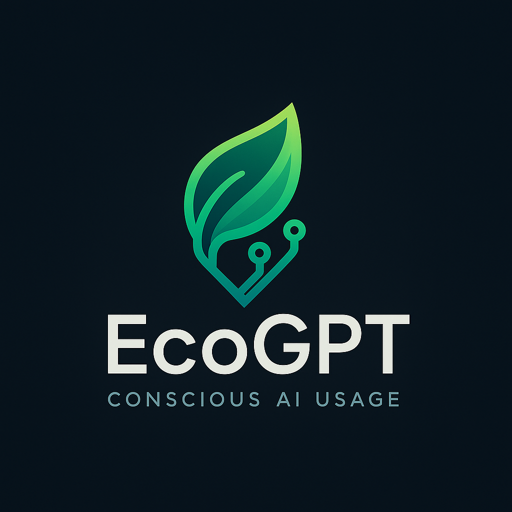

<p align="center">
  
</p>

# AI Impact Tracker

A Chrome extension that tracks the environmental impact of your ChatGPT usage by calculating real-time energy consumption and CO2 emissions.

## How to Run

1. **Clone or download this repository**
   ```bash
   git clone <your-repo-url>
   ```

2. **Load the extension in Chrome**
   - Open Chrome and go to `chrome://extensions/`
   - Enable **Developer mode** (toggle in top-right corner)
   - Click **Load unpacked**
   - Select the `hydrogpt` folder

3. **Start using**
   - Visit [ChatGPT](https://chatgpt.com)
   - The extension will automatically start tracking your AI usage
   - Click the extension icon to view your impact statistics

## What it does

- Monitors your ChatGPT conversations in real-time
- Calculates energy consumption (Wh) based on token usage
- Shows daily and lifetime usage statistics
- Uses the EcoLogits methodology for accurate estimates

## Author

Ishaan Gupta, Deetshana Parthipan, David Su, Jayson Tian, Derek Wu

## License

MIT

